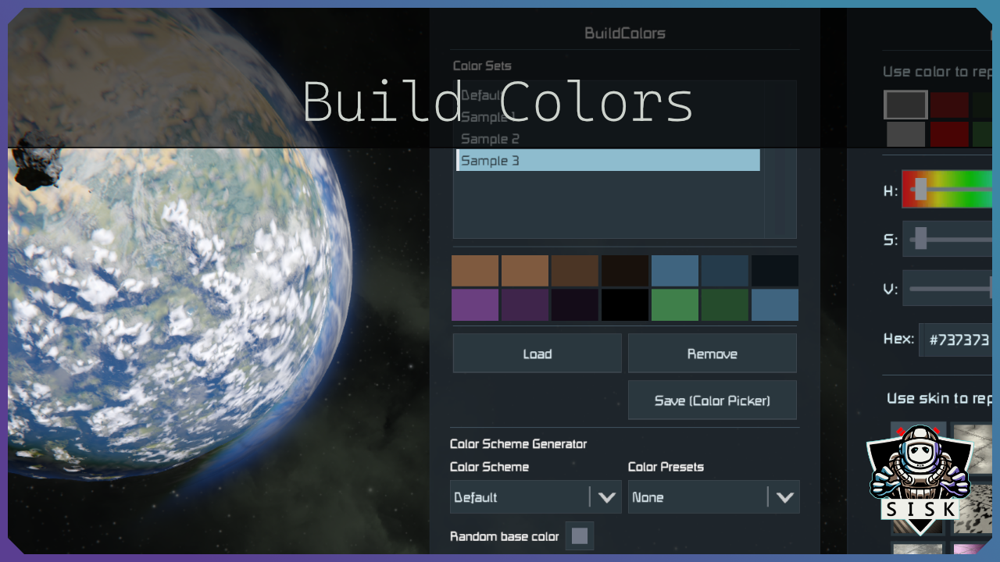

# Build Colors

* [Info](#info)
* [Color Sets](#color-sets)
* [Configs](#configs)
* [Credits](#credits)

## Info

This mod will restore your color palette in multiplayer and allow to create build color sets.
Color sets are stored locally and can also be used in single-player mode.

## Color Sets

To save or load a color set you have to type the listed commands below in your chat box.

`Usage: /bc [command] [arguments]`

**Available commands**:
* **save** [*name*] *- Saves a Color Set with the given name.*
* **load** [*name*] *- Loads a Color Set with the given name.*
* **remove** [*name*] *- Removes a Color Set with given name.*
* **list** *- Lists all available color sets.*
* **help** *- Shows a help window with all commands.*

## Configs

This mod can create two config files.
For servers a settings.xml file is created in your world storage.
Color sets are saved in ColorSets.xml in your global storage:
`"%appdata%\SpaceEngineers\Storage\ColorSets.xml"`

## Credits

Icons used in my mod:
* [palette](https://fontawesome.com/icons/palette?style=solid) icon by [Font Awesome](https://fontawesome.com) is licensed under [CC BY 4.0](https://fontawesome.com/license)
