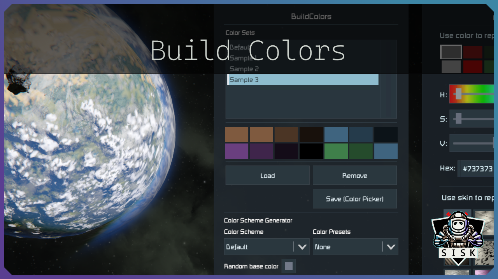

# Build Colors

- [Build Colors](#build-colors)
  - [Installation](#installation)
  - [Opening the build color panel](#opening-the-build-color-panel)
  - [Color Sets](#color-sets)
  - [Generator](#generator)
  - [Paint Jobs](#paint-jobs)
    - [Hotkeys](#hotkeys)
  - [Sharing](#sharing)
  - [Chat commands](#chat-commands)
  - [Where your stuff is saved](#where-your-stuff-is-saved)
  - [Support](#support)
  - [Credits](#credits)

Save your build palette under a name and load it in any world, on any server. Let the mod roll a matching palette for you. And set up paint jobs that repaint a whole grid the way you want it with one keypress, armor dark, damaged blocks red, a gradient from keel to deck.

Palettes and paint jobs can also be handed straight to another player.

## Installation

Subscribe on [Steam Workshop](https://steamcommunity.com/sharedfiles/filedetails/?id=1475392343), or find it on mod.io if you play there.

You can also grab the latest zip from [releases](https://github.com/SiskSjet/BuildColors/releases) and extract it into `%appdata%\SpaceEngineers\Mods`.

This mod is best used with [Rich HUD Master](https://steamcommunity.com/workshop/filedetails/?id=1965654081), add it to your world too.

## Opening the build color panel

Open the game's color picker (default `P`). Everything the mod does sits in the free space left of the vanilla controls, in one panel with three pages: **Color Sets**, **Generator** and **Paint Jobs**.

## Color Sets

A color set is your fourteen build color slots saved under a name.

The **Color Sets** page lists your sets and shows the selected one next to the palette you are building with, so you can compare before you load.

- **Double click** a set to load it, this replaces your whole palette
- **Load row 1** / **Load row 2** load only that half and leave the rest alone
- Click a swatch to change that single slot
- **Save current palette** stores what you have now
- Rename, duplicate, favourite, share or remove a set from the same page

Favourites sit at the top, and the filter box narrows a long list as you type.

## Generator

The **Generator** page builds a palette for you instead of you picking fourteen colors by hand.

1. Pick a **color scheme**, analogous, complementary, triadic, monochromatic, hull and accent, and more
2. Optionally pick a **preset** for the mood (with no preset the palette follows your base color)
3. Choose where the **base color** comes from: random, from your palette, sampled from the grid you are looking at, or picked by hand
4. Hit **Generate**

The first row is a light-to-dark ramp of the main color, the number keys you build most of a hull with. The second row holds the accents plus a few greys, slightly tinted so they do not look dirty next to your main color. You decide how many greys.

Click a generated swatch to edit it, **right click** to lock it. Locked colors survive the next roll, so you can work a palette out one color at a time. Changing the scheme, the preset or the greys re-rolls in place, so you see what that change did.

Happy with it? Save it as a color set.

## Paint Jobs

A paint job is a list of rules that gets applied to the grid you are looking at. Each rule says *which blocks* (heavy armor, damaged, a specific block, a size, a skin) and *what they get*, a color, an armor skin, or both. Rules are checked top down and the first match wins, so put your special cases above your catch-all.

A rule can paint more than a flat color:

- **Gradient**: fades between colors along an axis, e.g. dark keel to light deck
- **Camo**: patches
- **Scatter**: random pick per block, with weights
- **Pattern**: stripes or checkers

The same job on the same build always gives the same result, so applying it twice changes nothing.

Jobs are edited on the **Paint Jobs** page: jobs, the rules of the selected job, and the details of the selected rule side by side. Edits are saved as you make them, there is no save button.

### Hotkeys

One job is the **active** one, whatever you last selected on the Paint Jobs page. These work with no menu open and can be rebound in the Rich HUD terminal under Build Colors ▸ Controls:

| Default | Does |
| --- | --- |
| `Alt` + `P` | Apply the active paint job to the grid you are looking at |
| `Alt` + `Z` | Undo the last application |
| `Alt` + `.` | Next paint job |
| `Alt` + `,` | Previous paint job |

Two keys on purpose, repainting a whole grid should not happen from a stray keypress. They stay quiet while you are typing.

The last ten applications can be undone, until you leave the world.

## Sharing

**Share** on a color set or a paint job asks who gets it, one player, or everyone online, and sends it over.

Nothing lands in someone's list uninvited. A share shows up in their **Inbox** (the button carries the number waiting) and only **Accept** keeps it, saved under a free name so nothing of theirs is overwritten. **Decline** throws it away.

Shares only reach players who are online, and the inbox is emptied when you leave.

## Chat commands

Everything the panel does is also available in chat. Type `/bc help` in game for the full list.

`Usage: /bc [command] [arguments]`

**Color sets**

* `/bc save [name]`: save your current palette
* `/bc load [name]`: load a color set
* `/bc remove [name]`: delete a color set
* `/bc list`: list your color sets
* `/bc generate [scheme] [preset]`: roll a palette into your build colors, both arguments optional

**Paint jobs**

* `/bc jobs`: list your paint jobs
* `/bc showjob [job]`: show a job with its rules
* `/bc applyjob [job]`: apply a job to the grid you are looking at
* `/bc undojob`: undo the last application
* `/bc newjob [name]`, `/bc copyjob`, `/bc renamejob`, `/bc removejob`

**Sharing**

* `/bc share [name] [player]`: send a color set; without a player it goes to everyone online
* `/bc sharejob [job] [player]`: send a paint job
* `/bc shares`: list what others sent you
* `/bc accept [name]` / `/bc decline [name]`: keep or drop a share

Names with spaces go in quotes: `/bc applyjob "My Hull"`. Instead of a name you can use a position from the listing, like `#2`.

Building rules, conditions, gradients and camo is far easier on the panel, the chat commands for those exist, and `/bc help` shows them.

## Where your stuff is saved

Your color sets and paint jobs live in your global storage, so they follow you into every world:

* `%appdata%\SpaceEngineers\Storage\ColorSets.xml`
* `%appdata%\SpaceEngineers\Storage\PaintJobs.xml`

## Support

It would be nice if you could consider supporting me

You can also check out my other mods in my [Workshop](https://steamcommunity.com/id/sisksjet/myworkshopfiles/?appid=244850).

## Credits

* Thanks [Dark Helmet](https://steamcommunity.com/id/zigglegarf) for the awesome UI library: [Rich HUD Master](https://steamcommunity.com/workshop/filedetails/?id=1965654081)
